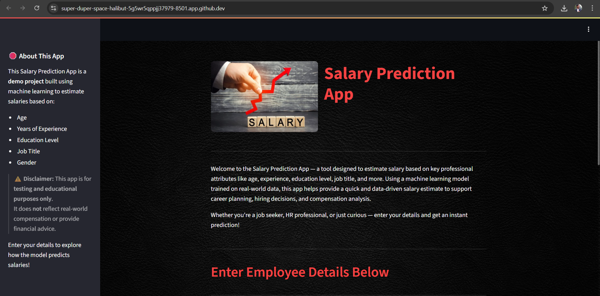

# 💰 Salary Predictor 

This is an app for predicting salaries, featuring a clean interface, user-friendly controls, and a robust set of input features to generate accurate predictions.

---

## 🚀 Overview

This web app predicts salaries using a trained **Linear Regression** model. It's built with **Streamlit** and allows users to input various characteristics to estimate potential salary instantly.

---

## ✅ Key Features

- 🧠 Linear Regression model chosen after testing multiple regression algorithms.  
- 🎯 Optimized and interactive UI using column-based layout.  
- 🧪 Input validation to ensure values remain within valid ranges.  
- 🌀 Spinner animation while model predicts.  
- 📏 Currency output formatted in Indian Rupees (INR).

---

## 🧰 Tech Stack

- **Python**  
- **Streamlit** (Web UI)  
- **Pandas & NumPy** (Data manipulation)  
- **Scikit-learn** (Machine Learning)  
- **Matplotlib & Seaborn** (Data Visualization - during development)  
- **Pickle** (Model serialization)

---

## 📊 Model Performance

After evaluating several machine learning models, **Linear Regression** was selected due to its robust performance and generalization capabilities on both training and unseen test data.

### 🔍 Linear Regression Evaluation:

#### Train Performance
- **Mean Absolute Error (MAE)**: ₹10,458.60  
- **R² Score**: 0.9199

#### Test Performance
- **Mean Absolute Error (MAE)**: ₹10,371.59  
    * *Context:* This indicates that, on average, the model's predictions deviated by approximately **₹10,371.59** from the actual salaries. Given that the average salary within our dataset was **₹99,985.65**, this MAE translates to an average absolute percentage error of roughly **10.37%**.  
- **R² Score**: 0.8905

> ⚠️ **Note**: While the model's performance metrics suggest room for improvement for precise valuations, the dataset's inherent complexities and potential limitations are recognized. Nonetheless, the model performs reliably for general trend analysis and initial estimation use cases.

---

## 🖼️ Screenshot

Here’s a preview of the app interface:

---

## 📊 Dataset Source

This project utilizes the [Machine Learning Model for Salary Prediction YouTube video](https://www.youtube.com/watch?v=qNl9IvkCl8o&t=1047s) as a primary guide for understanding the model building process for salary prediction using linear regression. This video provided valuable insights into data preparation, exploratory data analysis, feature engineering, and model training. While the core concepts and methodologies were informed by this resource, the implementation and specific adaptations for this application are my own, and the entire project was not copied. The dataset used in the video includes characteristics such as age, experience, salary, degree, gender, and job title.

> ⚠️ **Note on Gender**: The dataset includes only two gender categories. This limitation is based on the dataset itself, and **no offence or exclusion is intended**. The implementation reflects the data's structure and is purely for technical demonstration.

---

## 📌 Disclaimer

> This is an educational project. The predicted values are **estimated** and **not meant for real-world financial decision-making**. Use the app for learning and experimentation only.

---

## 📁 Project Structure

├── app.py
├── model/
│ └── model_pipeline.pkl
├── dataset/
│ └── Dataset09-Employee-salary-prediction.csv 
├── images/
│ └── screenshot.png 
├── requirements.txt
└── README.md